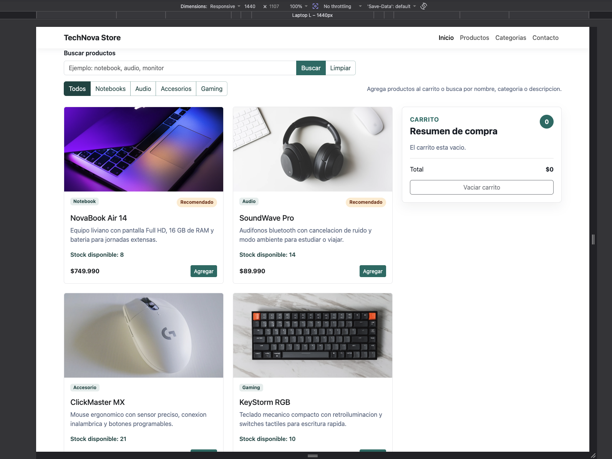
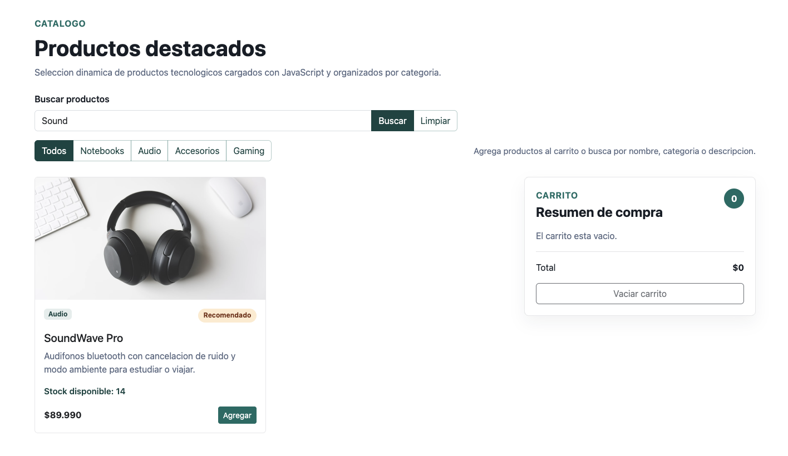
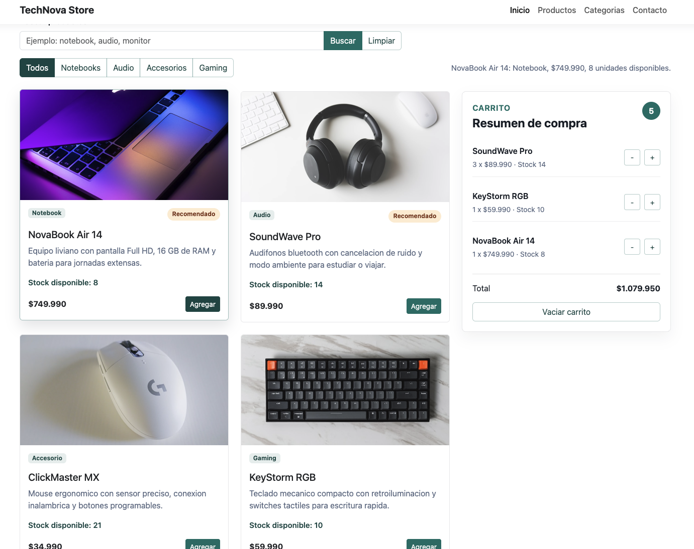
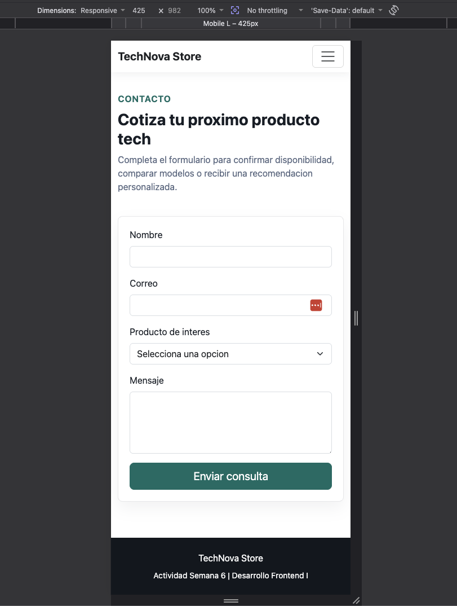

# TechNova Store

Actividad sumativa de la Semana 6 para Desarrollo Frontend I. El proyecto implementa una pagina eCommerce responsiva con Bootstrap 5 y JavaScript, usando datos desde un archivo JSON local, busqueda dinamica, manipulacion del DOM y carrito de compras.

## Descripcion

TechNova Store presenta un catalogo de productos tecnologicos cargado dinamicamente desde `assets/data/productos.json`. La interfaz permite buscar productos mientras se escribe, filtrar por categorias simuladas, agregar productos al carrito, controlar cantidades sin superar el stock disponible y visualizar el total de compra.

## Tecnologias utilizadas

- HTML5
- CSS3
- Bootstrap 5 por CDN
- JavaScript
- Fetch API
- JSON local
- Imagenes locales en JPG y WebP

## Funcionalidades principales

- Navbar responsiva con Bootstrap 5.
- Carrusel promocional con imagenes locales.
- Categorias simuladas para productos.
- Cards de productos renderizadas dinamicamente.
- Busqueda de productos mediante formulario con evento `submit`.
- Busqueda instantanea con evento `input`.
- Evento `click` para agregar productos al carrito.
- Carrito dinamico con cantidades, total y validacion de stock.
- Botones para sumar, restar y vaciar productos del carrito.
- Manejo de errores si el archivo JSON no carga correctamente.
- Formulario de contacto validado con JavaScript.
- Codigo separado en HTML, CSS, JavaScript, JSON e imagenes.

## Estructura del proyecto

```text
Desarrollo_Frontend_I_Exp2/
├── index.html
├── README.md
├── assets/
│   ├── css/
│   │   └── styles.css
│   ├── data/
│   │   └── productos.json
│   ├── img/
│   │   ├── hero/
│   │   └── products/
│   └── js/
│       └── app.js
└── screenshots/
    ├── desktop.png
    ├── busqueda.png
    ├── carrito.png
    └── mobile.png
```

## Como ejecutar el proyecto

Para que Fetch API cargue correctamente el archivo JSON, se recomienda ejecutar el proyecto desde un servidor local o desde GitHub Pages.

```bash
python3 -m http.server 8000
```

Luego abre:

```text
http://localhost:8000
```

## Capturas de pantalla

### Vista principal en escritorio



### Busqueda de productos



### Carrito de compras



### Vista movil



## Publicacion

- Repositorio GitHub: [Enlace Directo](https://github.com/Arekkusu17/Desarrollo_Frontend_I_Exp2)
- Sitio publicado: [GitHub Pages](https://arekkusu17.github.io/Desarrollo_Frontend_I_Exp2/)

