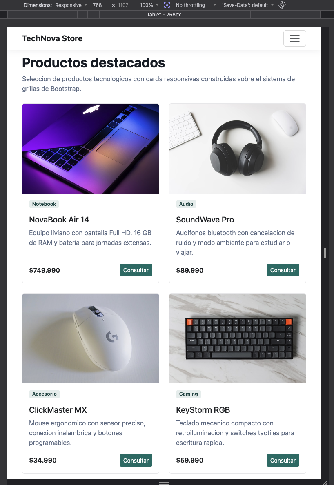

# TechNova Store

Actividad formativa de la Semana 5 para Desarrollo Frontend I. El proyecto toma como base el sitio responsivo creado en la Semana 4 y agrega interactividad con JavaScript, manipulacion del DOM, eventos y carga de datos externos con Fetch API.

## Descripcion

TechNova Store presenta un catalogo de productos tecnologicos. La pagina incluye una barra de navegacion responsiva, un carrusel promocional, filtros por categoria, cards de productos generadas dinamicamente, seleccion de productos para consulta y un formulario validado con JavaScript.

## Tecnologias utilizadas

- HTML5
- CSS3
- Bootstrap 5 por CDN
- JavaScript
- Fetch API
- JSON local para datos de productos
- Imagenes locales en JPG
- Versiones WebP para mobile

## Funcionalidades de Semana 5

- Carga de productos desde `assets/data/productos.json`.
- Renderizado dinamico de cards mediante JavaScript.
- Manipulacion del DOM para actualizar catalogo, resumen, mensajes y opciones del formulario.
- Filtros por categoria con evento `click`.
- Detalle rapido de producto mediante evento `mouseover` y foco de teclado.
- Boton `Consultar` para seleccionar un producto y completar el campo correspondiente del formulario.
- Validacion de formulario con evento `submit`.
- Mensajes de error y exito mostrados dentro de la pagina.
- Manejo de errores si no se puede cargar el archivo JSON.

## Estructura del proyecto

```text
Desarrollo_Frontend_I_Exp2/
├── index.html
├── README.md
├── assets/
│   ├── css/
│   │   └── styles.css
│   ├── data/
│   │   └── productos.json
│   └── images/
│       ├── hero/
│       │   ├── audio.jpg
│       │   ├── notebooks.jpg
│       │   ├── setup.jpg
│       │   └── mobile/
│       │       ├── audio.webp
│       │       ├── notebooks.webp
│       │       └── setup.webp
│       └── products/
│           ├── headphones.jpg
│           ├── keyboard.jpg
│           ├── monitor.jpg
│           ├── mouse.jpg
│           ├── notebook.jpg
│           ├── speaker.jpg
│           └── mobile/
│               ├── headphones.webp
│               ├── keyboard.webp
│               ├── monitor.webp
│               ├── mouse.webp
│               ├── notebook.webp
│               └── speaker.webp
│   └── js/
│       └── app.js
└── screenshots/
    ├── desktop.png
    ├── tablet.png
    └── mobile.png
```

## Requisitos implementados

- Navbar responsiva con Bootstrap.
- Carousel de Bootstrap configurado con cambio automatico cada 3 segundos.
- Sistema Grid para adaptar el contenido a distintos tamanos de pantalla.
- Cards dinamicas para presentar productos tecnologicos.
- Codigo separado en HTML, CSS y JavaScript externo.
- Eventos `click`, `mouseover` y `submit`.
- Uso de Fetch API para cargar datos desde JSON.
- Validaciones de formulario con JavaScript.
- Imagenes descargadas localmente para evitar dependencia de internet en recursos visuales.
- Versiones WebP optimizadas para mobile.
- Textos alternativos en imagenes para mejorar accesibilidad.

## Como ejecutar el proyecto

Para que Fetch API cargue correctamente el archivo JSON, se recomienda abrir el sitio desde un servidor local o desde GitHub Pages.

Ejemplo con Python:

```bash
python3 -m http.server 8000
```

Luego abre:

```text
http://localhost:8000
```

## Pruebas recomendadas

- Confirmar que el catalogo carga los 6 productos desde el JSON.
- Probar filtros: Todos, Notebooks, Audio, Accesorios y Gaming.
- Pasar el mouse sobre una card y verificar el detalle rapido.
- Presionar `Consultar` y comprobar que se selecciona el producto en el formulario.
- Enviar el formulario vacio y validar el mensaje de error.
- Enviar un correo invalido y validar el mensaje correspondiente.
- Completar todos los campos y confirmar el mensaje de exito.
- Revisar la pagina en escritorio, tablet y movil.

## Capturas de pantalla

Agrega aqui las capturas solicitadas por la actividad.

### Escritorio


### Tablet



### Movil


